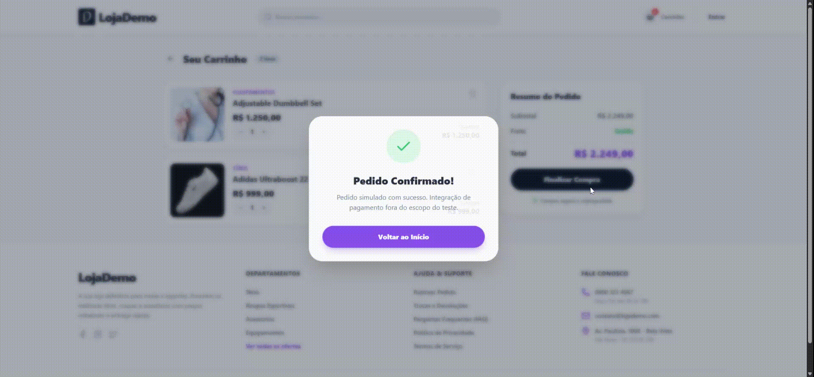
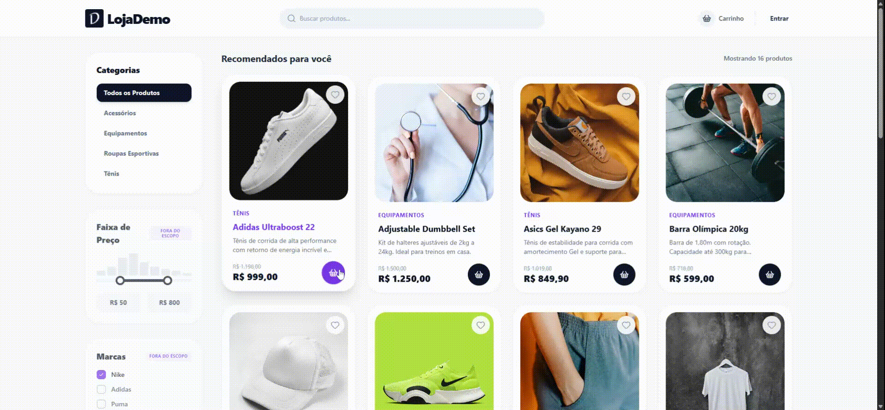

<p align="center">
  
</p>

# LojaDemo

> E-commerce fullstack com React 19, Laravel 12 e MySQL 8 — focado em UX, decisões técnicas sólidas e arquitetura pronta para crescer.

[](https://lojademo.rfsolucoes.com.br)
[](https://api-lojademo.rfsolucoes.com.br)
[](https://www.php.net/)
[](https://laravel.com)
[](https://react.dev)
[](https://www.typescriptlang.org/)
[](https://docs.docker.com/compose/)

---

## Live Demo

| Ambiente | URL |
|----------|-----|
| Frontend (SPA) | <https://lojademo.rfsolucoes.com.br> |
| Backend (API) | <https://api-lojademo.rfsolucoes.com.br> |

HTTPS via Let's Encrypt + Traefik, provisionado automaticamente pelo [Coolify](https://coolify.io).

### Demonstração

| Tela inicial | Login | Carrinho |
|--------------|-------|----------|
|  |  |  |

---

## Funcionalidades

- Catálogo de produtos com paginação, filtro por categoria e busca full-text
- Carrinho de compras persistente (localStorage via Zustand)
- Autenticação completa: registro, login e alteração de senha (Sanctum)
- Indicador de força de senha em tempo real (barra de progresso colorida)
- Desconto promocional calculado no model, exibido no frontend
- Notificações toast para todas as ações do usuário
- Layout responsivo, skeleton loaders e transições suaves
- CRUD de produtos e categorias (autenticado)

---

## Tech Stack

### Frontend

| Biblioteca | Versão | Função |
|---|---|---|
| React | 19 | UI |
| TypeScript | 5.8 | Tipagem estática |
| Vite | 6 | Build / dev server |
| Tailwind CSS | 3.4 | Estilização utility-first |
| Zustand | 5 | Gerenciamento de estado |
| React Router | 7 | Roteamento client-side |
| Axios | 1.x | HTTP client |
| Lucide React | 0.575 | Ícones |

### Backend

| Lib / Serviço | Versão | Função |
|---|---|---|
| PHP | 8.4 | Runtime |
| Laravel | 12 | Framework |
| Laravel Sanctum | 4.3 | Autenticação SPA |
| MySQL | 8.0 | Banco de dados |

### Infraestrutura

| Ferramenta | Função |
|---|---|
| Docker Compose | Orquestração local e produção |
| Coolify | PaaS self-hosted (deploy, SSL, proxy) |
| Traefik | Proxy reverso + Let's Encrypt automático |

---

## Decisões Técnicas

### 1. Zustand ao invés de Context API

O Context API força re-renders em toda a árvore de componentes ao alterar estado. Zustand faz subscrições seletivas: cada componente ouve apenas o slice de estado que usa. Bundle de ~1 KB, zero boilerplate, tipagem TypeScript nativa e middleware `persist` embutido para o carrinho.

```ts
// Carrinho persistido no localStorage automaticamente
export const useCartStore = create<CartState>()(
  persist((set, get) => ({ ... }), { name: 'ecommerce-cart' })
);
```

### 2. Indicador de força de senha (gamificação progressiva)

Feedback visual em tempo real durante o cadastro: a barra muda de vermelho → laranja → amarelo → verde conforme a senha ganha complexidade (comprimento, maiúsculas, números, símbolos). O botão de submit fica bloqueado até atingir o nível mínimo, evitando senhas fracas sem mensagem de erro após o envio.

```tsx
<div className={`h-full ${getStrengthWidth(score)} ${getStrengthColor(score)} transition-all duration-500`} />
```

### 3. Valores monetários como INT (centavos)

Ponto flutuante não representa valores decimais com precisão exata em binário (`0.1 + 0.2 !== 0.3`). Armazenar preços como inteiro em centavos elimina esse risco completamente.

```php
// Migration: price INT (centavos)
$table->unsignedInteger('price'); // 1099 = R$ 10,99
```

```ts
// Exibição no frontend
const format = (cents: number) =>
  (cents / 100).toLocaleString('pt-BR', { style: 'currency', currency: 'BRL' });
```

### 4. Repository Pattern + Contracts + Interfaces

A camada `Controller → Service → Repository → Eloquent` desacopla regras de negócio do framework. Cada repositório implementa um contrato (interface PHP), o que permite trocar a implementação (ex: cache, outro ORM) sem alterar os serviços ou controllers.

```
AuthController
   └── ProductService
          └── ProductRepositoryInterface ← ProductRepository (Eloquent)
```

O binding é feito no `AppServiceProvider`:

```php
$this->app->bind(ProductRepositoryInterface::class, ProductRepository::class);
```

### 5. Object Calisthenics — early return

Controllers e services retornam cedo quando a condição não é satisfeita, evitando if-else aninhados e reduzindo a complexidade ciclomática.

```php
public function paginate(...): LengthAwarePaginator
{
    $query = Product::query()->with('category');

    if ($categoryId !== null) {
        $query->where('category_id', $categoryId);
    }

    $search = $search !== null ? trim($search) : '';
    if ($search === '') {
        return $query->orderBy('name')->paginate($perPage);
    }

    $this->applySearch($query, $search);
    return $query->orderBy('name')->paginate($perPage);
}
```

### 6. Busca full-text + índice composto

Para buscas curtas (< 4 chars) é usado `LIKE`. A partir de 4 caracteres, o MySQL usa o índice FULLTEXT, que é ordens de grandeza mais rápido em tabelas grandes.

```php
// Migration
$table->index(['category_id', 'name'], 'idx_products_category_name');
$table->fullText(['name', 'description'], 'ft_products_name_description');
```

### 7. Desconto no Model

O desconto de 10% é calculado como atributo virtual (`$appends`) no Eloquent. A constante `DISCOUNT_PERCENT` pode ser facilmente movida para `config/app.php`, `.env` ou até uma tabela de promoções no futuro sem alterar o contrato da API.

```php
private const DISCOUNT_PERCENT = 10;

public function getPricePromotionalAttribute(): int
{
    return (int) round($this->price * (1 - self::DISCOUNT_PERCENT / 100));
}
```

### 8. Toast Notifications

Toda ação assíncrona (adicionar ao carrinho, login, erro de rede) dispara um toast via Zustand store dedicado. Isso padroniza o feedback ao usuário sem poluir os componentes com lógica de exibição de mensagem.

---

## Arquitetura

```
┌─────────────────────────────────────────────────────┐
│                     CLIENTE                         │
│           React 19 + Vite (SPA)                     │
│   Zustand (auth / cart / toast)  React Router       │
└────────────────────┬────────────────────────────────┘
                     │ HTTPS (Traefik / Let's Encrypt)
┌────────────────────▼────────────────────────────────┐
│                  BACKEND API                        │
│              Laravel 12 + Sanctum                   │
│                                                     │
│  Route → Controller → Service → Repository          │
│                          ↓                          │
│                    Eloquent ORM                     │
└────────────────────┬────────────────────────────────┘
                     │
┌────────────────────▼────────────────────────────────┐
│                  BANCO DE DADOS                     │
│              MySQL 8.0 (Docker volume)              │
│   idx: category_id+name   fulltext: name+desc       │
└─────────────────────────────────────────────────────┘
```

### Escalabilidade

O projeto está estruturado como um **monolito modular** — abordagem adequada para MVP. A separação de camadas permite escalar cada parte de forma independente quando necessário:

| Necessidade | Estratégia |
|---|---|
| Mais tráfego no frontend | CDN (Cloudflare) + assets estáticos em bucket |
| API sobrecarregada | Réplicas Docker (`--scale lojademo-service=3`) + load balancer no Traefik |
| Banco lento em leitura | Read replicas MySQL + cache Redis (Cache driver já configurável via `.env`) |
| Buscas mais complexas | Migração do FULLTEXT para Meilisearch ou Elasticsearch (repositório isola a lógica) |
| Jobs assíncronos | Laravel Queue já instalado (tabela `jobs` criada); basta adicionar worker + Redis driver |

> O padrão Repository garante que trocar a camada de dados (MySQL → Redis para cache, FULLTEXT → Meilisearch) não impacta controllers nem services.

---

## Testes

O backend possui **51 testes** automatizados (PHPUnit), cobrindo API, modelos e serviços.

- **Feature:** Auth (registro, login, logout, alteração de senha), Products (CRUD, listagem com filtros e busca, validações), Categories (CRUD e validações).
- **Unit:** Models `Product` e `Category` (relacionamentos, atributos, preço promocional), `ProductService` e `CategoryService` (conversão de preço, delegação ao repositório).

Para rodar os testes (com Docker):

```bash
docker compose exec lojademo-service php artisan test
```

Os testes usam SQLite em memória (configurado em `phpunit.xml`); não é necessário banco MySQL rodando apenas para a suíte de testes.

---

## Estrutura do Projeto

```
lojademo/
├── docker-compose.yaml              # Ambiente de desenvolvimento
├── docker-compose.production.yaml  # Ambiente de produção (Traefik labels)
├── .env.example                     # Variáveis de ambiente necessárias
│
├── projects/
│   ├── lojademo-service/            # Backend Laravel 12
│   │   ├── app/
│   │   │   ├── Http/Controllers/Api/
│   │   │   ├── Http/Requests/       # Form Requests (validação)
│   │   │   ├── Http/Resources/      # API Resources (serialização)
│   │   │   ├── Models/
│   │   │   ├── Repositories/        # Repository + Contracts
│   │   │   └── Services/
│   │   ├── database/
│   │   │   ├── migrations/
│   │   │   └── seeders/
│   │   ├── Dockerfile               # Dev
│   │   └── Dockerfile.production    # Produção (multi-stage)
│   │
│   └── lojademo-react/              # Frontend React 19
│       ├── src/
│       │   ├── components/
│       │   ├── pages/
│       │   ├── services/            # Axios (AuthService, ProductService…)
│       │   ├── store/               # Zustand (auth, cart, toast)
│       │   ├── types/
│       │   └── utils/               # passwordStrength, formatCurrency…
│       ├── Dockerfile               # Dev
│       └── Dockerfile.production    # Produção (build + serve)
```

---

## Quick Start (local)

**Pré-requisitos:** Docker e Docker Compose

Repositório: **[github.com/faelfernandes/loja-demo-teste](https://github.com/faelfernandes/loja-demo-teste)**

```bash
# 1. Clone o repositório
git clone https://github.com/faelfernandes/loja-demo-teste.git
cd loja-demo-teste

# 2. Variáveis de ambiente (raiz — usadas pelo Docker Compose)
cp .env.example .env
# Opcional: edite .env com senhas do MySQL

# 3. Backend Laravel — o container exige este arquivo
cp projects/lojademo-service/.env.example projects/lojademo-service/.env

# 4. Frontend React (base URL da API em desenvolvimento)
cp projects/lojademo-react/.env.example projects/lojademo-react/.env

# 5. Subir os containers
docker compose up --build
```

**Acesso:**

| Serviço   | URL                    |
|-----------|------------------------|
| Frontend  | http://localhost:3000  |
| API       | http://localhost:8081   |

**Primeira vez — gerar chave Laravel e rodar migrations/seeders:**

Se o backend subir mas a API retornar erro de `APP_KEY`, rode **na raiz do projeto** (mesmo diretório onde você executou `docker compose up`):

```bash
docker compose exec lojademo-service php artisan key:generate
docker compose exec lojademo-service php artisan migrate --force
docker compose exec lojademo-service php artisan db:seed --force
docker compose restart lojademo-service
```

> **Dica:** Os comandos `docker compose exec` e `docker compose restart` usam o **nome do serviço** do YAML (`lojademo-service`, `lojademo-react`, `mysql`). O nome do **container** no `docker ps` será algo como `loja-demo-teste-lojademo-service-1` — o prefixo vem do nome da pasta do projeto. Sempre rode esses comandos a partir da pasta que contém o `docker-compose.yaml`.

### Variáveis de ambiente

**Raiz (`.env`)** — usadas pelo `docker-compose` (MySQL e substituição em outros serviços):

| Variável | Descrição |
|----------|------------|
| `MYSQL_ROOT_PASSWORD` | Senha root do MySQL |
| `DB_DATABASE` | Nome do banco |
| `DB_USERNAME` | Usuário da aplicação |
| `DB_PASSWORD` | Senha do usuário da aplicação |

**Backend (`projects/lojademo-service/.env`)** — Laravel (copie de `.env.example` e ajuste se precisar). O `APP_KEY` pode ser gerado com `php artisan key:generate` dentro do container (passo acima).

**Frontend (`projects/lojademo-react/.env`)** — Vite: `VITE_APP_NAME`, `VITE_API_BASE_URL` (ex.: `http://localhost:8081/api` para desenvolvimento).

---

## API — Endpoints Principais

```
POST   /api/login                    Autenticar usuário
POST   /api/register                 Cadastrar usuário
POST   /api/logout              [🔒] Encerrar sessão
PUT    /api/user/password       [🔒] Alterar senha

GET    /api/products                 Listar produtos (paginado, filtro, busca)
GET    /api/products/{id}            Detalhe do produto
POST   /api/products            [🔒] Criar produto
PUT    /api/products/{id}       [🔒] Atualizar produto
DELETE /api/products/{id}       [🔒] Remover produto

GET    /api/categories               Listar categorias
POST   /api/categories          [🔒] Criar categoria
PUT    /api/categories/{id}     [🔒] Atualizar categoria
DELETE /api/categories/{id}     [🔒] Remover categoria
```

Parâmetros de listagem de produtos: `?page=1&per_page=15&category_id=2&search=tênis`

---

## Autor

Feito por **Fael Fernandes** — [Site](https://rafaelfernandes.me/) · [LinkedIn](https://www.linkedin.com/in/rafaelfernandes) · [GitHub](https://github.com/faelfernandes)
